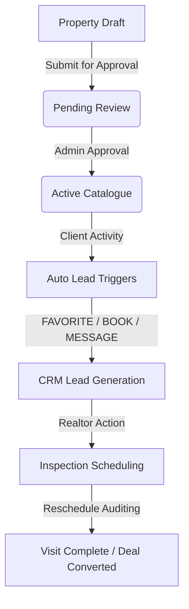

# Phase D: Realtor Experience Documentation

Welcome to the **LINPAL Premium Estates Realtor Workspace**. This document provides a complete guide and technical manual for the newly integrated Realtor Experience, designed specifically for real estate brokers to manage their daily pipeline seamlessly.

---

## 1. Core Architecture

The Realtor experience follows a secure, centralized REST API structure designed around the primary broker workflow:



### Database Enhancements
We upgraded the MongoDB database schemas with:
1. **`User` Schema**: Appended fields `bio`, `agency`, `specialties`, and `serviceAreas` to define specialized business credentials.
2. **`Lead` Schema**: Formed a new Mongoose collection to trace prospective clients. Indexed on `realtorId + status` and `realtorId + createdAt`, with a compound unique index on `{ propertyId, clientId }` to prevent redundant entries on multiple interactions.
3. **`Booking` Schema**: Added a sub-document audit `history` array:
   ```javascript
   history: [{
     previousScheduledAt: Date,
     rescheduledAt: Date,
     rescheduledBy: String,
     updatedAt: Date
   }]
   ```

---

## 2. Secure Backend Business Rules

We enforced stringent security guards and automated triggers under `requireActiveAccount` and `authorizeRoles("realtor")`:

*   **Security Ownership Validation**: Every mutation on properties, leads, and bookings parses the MongoDB profile ID derived from the Firebase authentication context (`req.userDocument._id`). Body injection of `realtorId` or `clientId` is strictly blocked and rejected by Zod schemas.
*   **Automatic Lead Generation**: We added active intercept hooks into key client-side actions to automatically populate the Realtor's CRM pipeline with zero manual entry:
    1.  **Favouriting**: Client favorites a listing → Upsert/Touch `Lead` (source: `"favourite"`).
    2.  **Inspection Bookings**: Client requests a viewing → Upsert/Touch `Lead` (source: `"booking"`).
    3.  **Chat Inquiries**: Client opens a property conversation → Upsert/Touch `Lead` (source: `"conversation"`).
*   **Cloudinary Security Rule**: The mobile application does not possess or store any Cloudinary API secrets. Image uploads utilize secure presigned flows, preserving security boundaries.

---

## 3. Premium Client Experience & Tab Navigation

We implemented an extremely clean, high-performance interface satisfying strict UI/UX constraints:

### Strict 4-Tab Bottom Bar Navigation
The bottom bar is restricted to exactly **4 tabs**, removing the generic `more` tab. The navigation routing layout (`app/(realtor)/_layout.js`) maps to:
1.  **Dashboard** (Home)
2.  **Properties** (Listing catalogue)
3.  **Messages** (Client chats with unread badge updates)
4.  **Profile** (Realtor business profile settings)

### Realtor Screen Highlights
*   **Dashboard (`dashboard.js`)**: Real-time numerical grids mapping active portfolios, viewing pipelines, unread messages, and fresh leads. Includes immediate cards for the next scheduled inspection, recent active leads timeline, and quick-action shortcuts.
*   **Properties Catalog (`properties/index.js`)**: Dynamic state-managed catalog enabling realtors to search, filter by listing status (Active, Pending, Draft, Rejected), and safely archive listings.
*   **Property Creation & Editing (`new.js` & `edit.js`)**: Double-workflow form sheets. Supports saving as a `"Save Draft"` or submitting for admin review with `"Submit for Approval"`. Normalizes and translates file assets into precise backend-compliant URL lists.
*   **Property Details (`[id].js`)**: Renders a premium **Listing Performance & CRM** analytics panel displaying saves, active lead opportunities, and total booked viewings.
*   **Inspections Desk (`bookings.js`)**: Real-time viewing calendars. Provides quick actions to Approve, Complete, or Reject visits. Includes an **audited reschedule workflow** to move visits to tomorrow or next week, logging audits to database histories.
*   **Messaging Workspace (`messages/` & `[id].js`)**: Network-aware conversations. Passing `remote={true}` activates direct API fetching, letting brokers reply and read-mark client threads instantly.
*   **Agency Profile (`profile.js`)**: Custom forms permitting brokers to configure Specialties, Biography, Brokerage name, and Service regions seamlessly.

---

## 4. Integration Verification

We created comprehensive Vitest integration tests in `server/tests/realtor/realtorApi.test.js` covering:
*   Dashboard and statistics loads.
*   Paginated properties lists with owner context checks.
*   Zod validation rejection on body-injected `realtorId` or illegal `role` changes.
*   Booking state transitions (approvals, completions, reschedule histories).
*   CRM lead listings and status edits.
*   Profile modifications with whitelisted safe fields.
