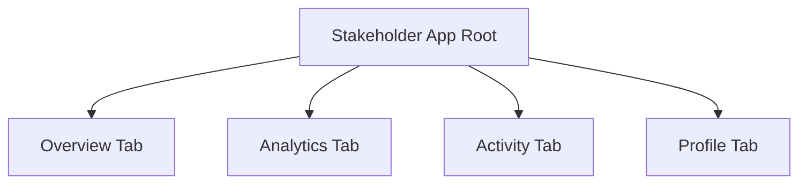

# Stakeholder Workspace Workflow Guide

This document defines how directors, executives, and investors navigate and interact with the LINPAL Premium Estates application.

---

## 🧭 Bottom-Navigation Structure
To prevent layout clutter, the Stakeholder workspace enforces exactly **four bottom-tabs**:

1.  **Overview Tab**: Presents portfolio totals, client registrations, active brokers, completed inspections, operational health checks, and a business period selector.
2.  **Analytics Tab**: Provides deep segmentations:
    *   *Portfolio Segment*: Inventory status counts and property type mixes.
    *   *Brokers Segment*: Interactive Realtor directory sorted by active listings or completed viewings.
    *   *Operations Segment*: Staff quality checks, review rates, and resolved application issues.
3.  **Activity Tab**: Paginated corporate audit feed representing platform event timelines (approved listings, resolved incidents, upcoming slots).
4.  **Profile Tab**: Safe biographical setting form, CSV spreadsheets generator buttons, and a sign-out mechanism.

---

## 🔄 User Operations Workflow

### 1. Business Period Scoping
Stakeholders filter dashboard statistics dynamically:
`Select Period` $\rightarrow$ `API request sent with query param` $\rightarrow$ `Aggregations recalculate server-side` $\rightarrow$ `Interface updates with crisp animations`.

### 2. Analytical Sorters
Under the Brokers segment, stakeholders sort directories in place:
`listings` (sorts by active listings volume) $\leftrightarrow$ `inspections` (sorts by completed viewings).

### 3. Lightweight Reporting
Spreadsheet downloads are fully interactive:
`Click Download` $\rightarrow$ `Overlay Spinner active` $\rightarrow$ `API compiles CSV rows` $\rightarrow$ `Slide-up Tray appears` $\rightarrow$ `Stakeholder copies rows or previews data`.
